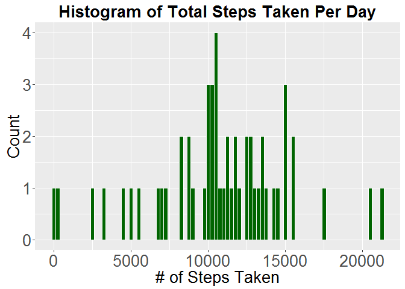
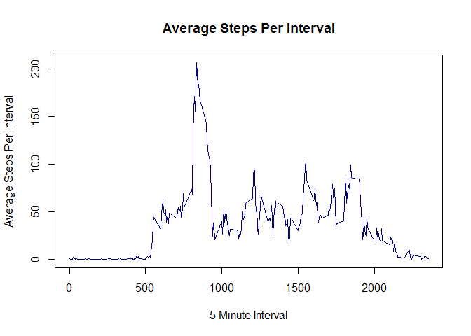
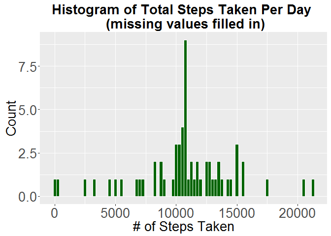

Introduction to the project
===========================

In this project, we examine the data set with steps taken by a person
wearing an activity monitoring device in 5 minute increments in October
and November in 2012.

1. Loading data
---------------

The activity data analyzed is first loaded.

    activity <- read.csv("activity.csv", stringsAsFactors = FALSE)
    head(activity)

    ##   steps       date interval
    ## 1    NA 2012-10-01        0
    ## 2    NA 2012-10-01        5
    ## 3    NA 2012-10-01       10
    ## 4    NA 2012-10-01       15
    ## 5    NA 2012-10-01       20
    ## 6    NA 2012-10-01       25

Date is converted from character to Date class.

    activity$date <- as.Date(activity$date)

2. What is the mean total number of steps taken per day?
--------------------------------------------------------

First, a data frame with daily total is created with aggregate function.

    total.steps.per.day <- aggregate(steps~date, activity, sum)

Second, we examine the histogram of total steps daken per day.

    library(ggplot2)
    g <- ggplot(total.steps.per.day, aes(x=steps))
    g <- g + geom_histogram(binwidth = 250, fill = 'darkgreen', colour = "white")
    g <- g + ggtitle("Histogram of Total Steps Taken Per Day")
    g <- g + theme(plot.title = element_text (size=20, face="bold"))
    g <- g + theme(axis.text.x = element_text(size = 20))
    g <- g + labs(x = "# of Steps Taken")
    g <- g + theme(axis.title.x = element_text(size = 20))
    g <- g + theme(axis.title.y = element_text(size = 20))
    g <- g + labs(y = "Count")
    g <- g + theme(axis.text.y = element_text(size = 20))
    g

Third, we calculate the mean and median for this dataset.

    mean(total.steps.per.day$steps)

    ## [1] 10766.19

    median(total.steps.per.day$steps)

    ## [1] 10765

3. What is the average daily activity pattern?
----------------------------------------------

First, we make a data frame with average steps per interval.

    average.steps.per.interval <- aggregate(steps~interval, activity, mean)

Second, we plot a time series plot of the 5-minute interval and the
average number of steps.

    plot(average.steps.per.interval$interval, average.steps.per.interval$steps, 
         type="l",
         col = "darkblue",
         xlab = "5 Minute Interval",
         ylab = "Average Steps Per Interval")
    title("Average Steps Per Interval")

Last, we calculate which 5-minute interval has the maximum number of
steps.

    library(dplyr)
    summarise_each(average.steps.per.interval, funs(max(., na.rm=TRUE)))

    ##   interval    steps
    ## 1     2355 206.1698

4. Imputing missing values
--------------------------

There are a number of missing values in the steps column. First, we
calculate that number.

    missing.steps <- sum(is.na(activity$steps))
    missing.steps

    ## [1] 2304

We find that there are 2304 number of missing values.

Second, we'll fill these missing values using the mean for that interval
using the plyr package.

    library(plyr)
    impute.mean <- function(x) replace(x, is.na(x), mean(x, na.rm = TRUE))
    activity2 <- ddply(activity, ~ interval , transform, steps = impute.mean(steps))
    activity2 <- activity2[order(activity2$date), ]

We investigate this data set with a histogram for the total number of
steps taken each day.

    total.steps.per.day2 <- aggregate(steps~date, activity2, sum)
    g <- ggplot(total.steps.per.day2, aes(x=steps))
    g <- g + geom_histogram(binwidth = 250, fill = 'darkgreen', colour = "white")
    g <- g + ggtitle("Histogram of Total Steps Taken Per Day \n (missing values filled in)")
    g <- g + theme(plot.title = element_text (size=20, face="bold"))
    g <- g + theme(axis.text.x = element_text(size = 20))
    g <- g + labs(x = "# of Steps Taken")
    g <- g + theme(axis.title.x = element_text(size = 20))
    g <- g + theme(axis.title.y = element_text(size = 20))
    g <- g + labs(y = "Count")
    g <- g + theme(axis.text.y = element_text(size = 20))
    g

The mean and median for this data set is computed.

    mean.s <- mean(total.steps.per.day$steps)
    median.s <- median(total.steps.per.day$steps)
    mean.s2 <- mean(total.steps.per.day2$steps)
    median.s2 <- median(total.steps.per.day2$steps)
    mean.difference <- mean.s - mean.s2
    median.difference <- median.s - median.s2

The mean and the median for the new data set are 1.076618910^{4} and
1.076618910^{4}, respectively. The first mean and median are
1.076618910^{4} and 10765, respectively. By filling in the missing
values, the mean changes by 0, and the median by -1.1886792.

5. Are there differences in activity patterns between weekdays and weekends?
----------------------------------------------------------------------------

First, we create a new data set with a new column that indicates whether
a day is a weekday or a weekend using the function mutate.

    weekend <- c("Saturday", "Sunday")

    activity3 <- mutate(activity2,
                        day = factor(1 * (weekdays(activity2$date) %in% weekend),
                        labels = c("weekday", "weekend")))

We can now examine average activity for weekend and weekday days, and
see that weekday has a spike in activity.

    average.steps.per.interval2 <- aggregate(steps~day+interval, activity3, mean)

    g <- ggplot(average.steps.per.interval2, aes(x = interval, y = steps)) +
         geom_line(lwd = 2, col = "darkred")
    g <- g + ggtitle("Weekday vs. Weekend Activity")
    g <- g + theme(plot.title = element_text (size=20, face="bold"))
    g <- g + theme(axis.text.x = element_text(size = 20, angle = 45))
    g <- g + labs(x = "Inverval")
    g <- g + theme(axis.title.x = element_text(size = 20))
    g <- g + theme(axis.title.y = element_text(size = 20))
    g <- g + labs(y = "# of Steps Taken")
    g <- g + theme(axis.text.y = element_text(size = 20))
    g <- g + facet_grid(. ~ day)
    g

